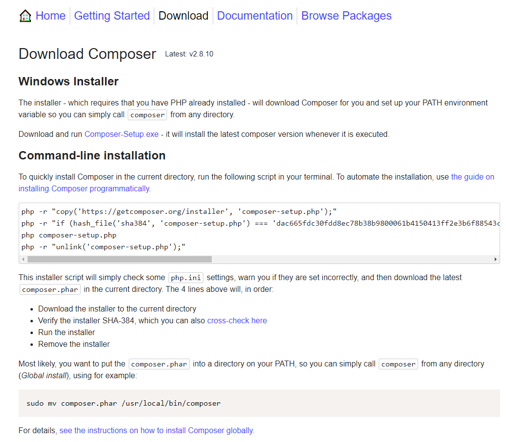
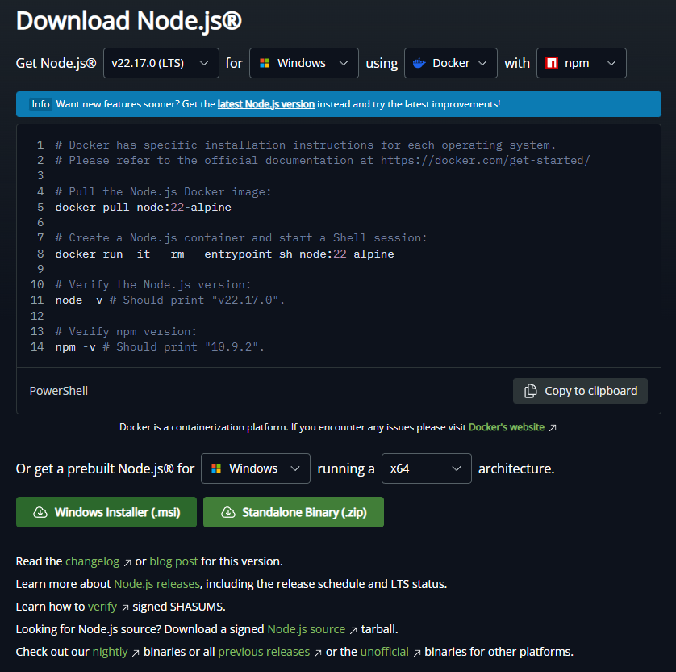
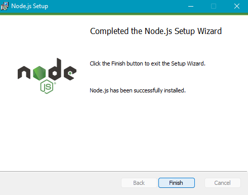
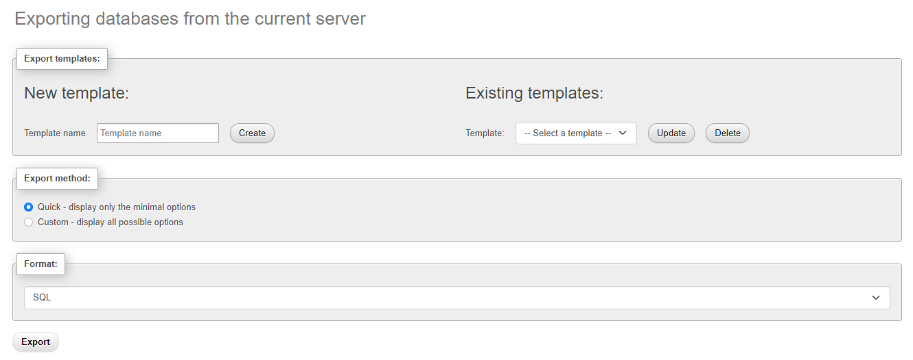

# Panduan Instalasi Sistem UPBG

## Daftar Isi

0. [Prerequisite](#prerequisite)
1. [Instalasi Dependency](#a-instalasi-dependency)
2. [Instalasi Project](#b-instalasi-project)
3. [Konfigurasi Database](#c-konfigurasi-database)
4. [Konfigurasi Hosting](#d-konfigurasi-hosting)
5. [Finalisasi](#e-finalisasi)

## Prerequisite

- Dokumentasi ini dibuat dengan asumsi terminal yang digunakan adalah `Command Prompt` atau `Git Bash` dan bukan `Windows Powershell` karena beberapa command pada `Command Prompt` berbeda dengan `Windows Powershell` .
- Dokumentasi ini sebagai acuan utama migrasi server sistem upbg dari komputer server lama ke komputer server baru, untuk panduan instalasi dari awal (bukan migrasi) juga sudah disertakan.

## A. Instalasi Dependency

| Dependency                                                             | Version             |
| ---------------------------------------------------------------------- | ------------------- |
| [XAMPP](https://sourceforge.net/projects/xampp/files/XAMPP%20Windows/) | 8.2.12 / PHP 8.2.12 |
| [composer](https://getcomposer.org/download/)                          | latest              |
| [nodejs](https://nodejs.org/dist/v22.17.0/node-v22.17.0-x64.msi)       | 22.17.0             |

*note:*  
*1. silahkan coba install versi terbaru terlebih dahulu, jika error gunakan versi yang tertera diatas*  
*2. link versi diatas hanya untuk windows, untuk sistem operasi lain silahkan ikuti petunjuk pada halaman download dibawah*  
*3. instruksi ditulis berdasarkan hasil percobaan pada windows, link referensi untuk linux sudah dicantumkan pada akhir tiap-tiap poin*  

### 1. XAMPP
#### Windows
Pergi ke halaman download [XAMPP](https://www.apachefriends.org/download.html) dan klik download pada versi yang terbaru. Saat dokumen ini dibuat, versi yang terbaru adalah 8.2.12 / PHP 8.2.12.


Jalankan file hasil download dan selesaikan proses install dengan menekan tombol next tanpa ada konfigurasi tambahan (default). Setelah proses selesai tekan finish untuk membuka control panel XAMPP.


Tekan tombol `Config` pada baris module Apache dan pilih php.ini


Hilangkan `;` pada 2 baris berikut pada file yang terbuka

| Asal           | Menjadi       |
| -------------- | ------------- |
| ;extension=gd  | extension=gd  |
| ;extension=zip | extension=zip |

Kemudian simpan dan tutup file php.ini. Jalankan XAMPP untuk module Apache dan MySQL


#### Linux
1. Ikuti panduan [Instalasi XAMPP pada Linux](https://hackernoon.com/how-to-install-xampp-on-linux-a-quick-step-by-step-guide)
2. Hilangkan `;` pada 2 baris pada file php.ini seperti panduan diatas
3. Jalankan XAMPP

### 2. Composer
#### Windows
Pastikan sudah menginstall XAMPP karena instalasi Composer membutuhkan PHP yang ada pada XAMPP. Pergi ke halaman download [Composer](https://getcomposer.org/download/) dan klik `Composer-Setup.exe` untuk mendownload versi yang terbaru.  



Jalankan file hasil download dan ikuti konfigurasi default. Pada bagian ini installer meminta kita untuk memilih versi PHP yang ada pada sistem, pastikan PHP yang digunakan adalah PHP dari xampp. Checklist `Add this PHP to your path?` untuk menambahkan PHP ke environment variables.


Selesaikan proses instalasi dengan konfigurasi default.

#### Linux
1. Pastikan sudah menginstall XAMPP karena instalasi Composer membutuhkan PHP yang ada pada XAMPP. 
2. Ikuti panduan [Instalasi Composer pada Ubuntu](https://phoenixnap.com/kb/how-to-install-composer-ubuntu)

### 3. nodejs
#### Windows
Pergi ke halaman download [nodejs](https://nodejs.org/en/download) dan klik download pada versi yang terbaru. Saat dokumen ini dibuat, versi yang terbaru adalah 22.17.0.



Jalankan file hasil download dan selesaikan instalasi dengan konfigurasi default.



#### Linux
1. Ikuti panduan [Instalasi nodejs pada Ubuntu](https://www.digitalocean.com/community/tutorials/how-to-install-node-js-on-ubuntu-20-04) 

## B. Instalasi Project

### Download Repository
Buka [repository project](https://github.com/NizamHakim/upbg) dan download project dalam zip.  


Unzip project pada folder `htdocs` pada tempat xampp diinstal (pada windows `C:/xampp/htdocs`).


Buka terminal pada folder project (upbg-master) dan jalankan command

```bash
composer install
```

dan

```bash
npm install
```

### Konfigurasi `.env`

`.env` adalah file konfigurasi dasar sistem dan untuk alasan keamanan `.env` tidak dimasukkan ke dalam github. Oleh karena itu perlu membuat `.env` sendiri menggunakan template `.env.example` . Copy file menggunakan command

```bash
cp .env.example .env
```

Beberapa konfigurasi yang perlu disesuaikan adalah sebagai berikut

```ini
APP_ENV=production
APP_DEBUG=false
APP_TIMEZONE=Asia/Jakarta
APP_URL=http://sim.upbg

APP_LOCALE=id
APP_FALLBACK_LOCALE=id
APP_FAKER_LOCALE=id_ID

DB_CONNECTION=mysql
DB_HOST=127.0.0.1
DB_PORT=3306
DB_DATABASE=upbg
DB_USERNAME=root
```

### Generate key
Lakukan key generation untuk mengisi `APP_KEY=` pada `.env` menggunakan command

```bash
php artisan key:generate
```

### Symbolic Link
Tambahkan symbolic link agar sistem dapat membaca file seperti foto menggunakan command

```bash
php artisan storage:link
```

## C. Konfigurasi Database

### Export database dari komputer server

Buka `phpmyadmin` pada komputer server sebelumnya kemudian `Export` database. Copy file hasil export untuk dipindahkan pada komputer server baru.



### Buat database baru

Pada komputer server yang baru buat database baru sesuai dengan nama yang digunakan pada `DB_DATABASE=` . Jika ingin menggunakan data dari database sebelumnya maka lakukan `Import` pada database yang baru dibuat.


Jika ingin menggunakan data yang lama maka import database yang sudah diexport sebelumnya


Jika tidak ingin menggunakan data yang lama maka jalankan command

```bash
php artisan migrate --seed
```

### Jalankan sistem

Setelah konfigurasi diatas seharusnya sistem sudah bisa dijalankan secara lokal menggunakan command

```bash
composer run dev
```

## D. Konfigurasi Hosting

TBA

## E. Finalisasi

Untuk mempermudah start server disarankan untuk membuat file baru untuk menjalankan command. Buka folder tempat anda ingin menyimpan file ini kemudian klik kanan dan pilih `Open in Terminal` .

### Windows

1. Buat file baru dengan menjalankan command

```bash
touch start_server.bat
```

2. Tambahkan command ke file menggunakan command

```bash
echo 'cd C:\xampp\htdocs\upbg && concurrently "php artisan serve --host=10.7.89.178" "npm run dev -- --host=10.7.89.178"' > start_server.sh
```

3. Sistem dapat distart dengan menjalankan (double click) file ini


### Linux

1. Buat file baru dengan menjalankan command

```bash
touch start_server.sh
```

2. Ubah permission menggunakan command

```bash
chmod +x start_server.sh
```

3. Tambahkan command ke file menggunakan command

```bash
echo 'cd C:\xampp\htdocs\upbg && concurrently "php artisan serve --host=10.7.89.178" "npm run dev -- --host=10.7.89.178"' > start_server.sh
```

sesuaikan path `C:\xampp\htdocs\upbg` pada linux

4. Sistem dapat distart dengan menjalankan (double click) file ini